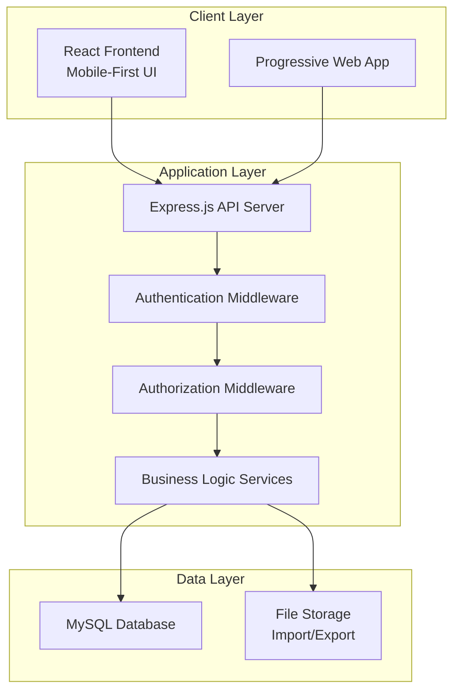
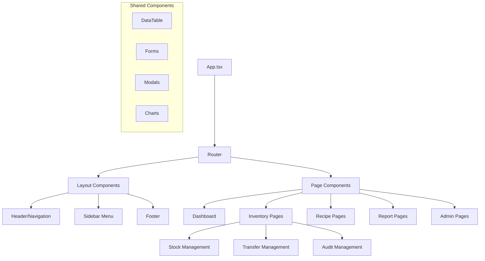

# Design Document - ระบบจัดการสต็อกสำหรับร้านอาหาร

## Overview

ระบบจัดการสต็อกสำหรับร้านอาหารเป็น web application ที่ใช้สถาปัตยกรรม 3-tier แบบ client-server โดยมี React frontend, Node.js/Express backend, และ MySQL database ระบบออกแบบมาเพื่อรองรับการทำงานแบบ multi-tenant สำหรับหลายสาขา พร้อมการจัดการสิทธิ์แบบ role-based และ UI ที่เน้น mobile-first design

## Architecture

### System Architecture



### Technology Stack

**Frontend:**
- React 18 with TypeScript
- Vite for build tooling
- React Router for navigation
- Axios for API communication
- Material-UI หรือ Tailwind CSS สำหรับ responsive design
- React Hook Form สำหรับ form management

**Backend:**
- Node.js with Express.js
- TypeScript
- JWT for authentication
- bcrypt for password hashing
- Multer for file uploads
- node-cron for scheduled tasks

**Database:**
- MySQL 8.0
- Sequelize ORM
- Database migrations and seeders

**Deployment:**
- Compatible with standard web hosting (DirectAdmin)
- Environment-based configuration
- PM2 for process management

## Components and Interfaces

### Frontend Components Architecture



### Backend API Structure

```
/api/v1/
├── auth/
│   ├── POST /login
│   ├── POST /register
│   ├── POST /refresh
│   └── POST /logout
├── users/
│   ├── GET /users
│   ├── POST /users
│   ├── PUT /users/:id
│   └── DELETE /users/:id
├── locations/
│   ├── GET /locations
│   ├── POST /locations
│   ├── PUT /locations/:id
│   └── DELETE /locations/:id
├── ingredients/
│   ├── GET /ingredients
│   ├── POST /ingredients
│   ├── PUT /ingredients/:id
│   ├── DELETE /ingredients/:id
│   └── POST /ingredients/bulk-import
├── inventory/
│   ├── GET /inventory/:locationId
│   ├── POST /inventory/stock-in
│   ├── POST /inventory/stock-out
│   ├── POST /inventory/transfer
│   └── POST /inventory/adjustment
├── recipes/
│   ├── GET /recipes
│   ├── POST /recipes
│   ├── PUT /recipes/:id
│   └── DELETE /recipes/:id
├── suppliers/
│   ├── GET /suppliers
│   ├── POST /suppliers
│   ├── PUT /suppliers/:id
│   └── DELETE /suppliers/:id
├── purchase-orders/
│   ├── GET /purchase-orders
│   ├── POST /purchase-orders
│   ├── PUT /purchase-orders/:id
│   └── PATCH /purchase-orders/:id/status
└── reports/
    ├── GET /reports/inventory-summary
    ├── GET /reports/stock-movement
    ├── GET /reports/cost-analysis
    └── GET /reports/variance
```

## Data Models

### Core Entities

#### Users and Authentication
```sql
-- Users table
users (
    id: UUID PRIMARY KEY,
    username: VARCHAR(50) UNIQUE,
    email: VARCHAR(100) UNIQUE,
    password_hash: VARCHAR(255),
    first_name: VARCHAR(50),
    last_name: VARCHAR(50),
    role: ENUM('admin', 'area_manager', 'central_kitchen_manager', 'restaurant_manager', 'head_chef', 'staff'),
    location_id: UUID FOREIGN KEY,
    is_active: BOOLEAN DEFAULT true,
    created_at: TIMESTAMP,
    updated_at: TIMESTAMP
)

-- Sessions table for JWT management
user_sessions (
    id: UUID PRIMARY KEY,
    user_id: UUID FOREIGN KEY,
    refresh_token: VARCHAR(255),
    expires_at: TIMESTAMP,
    created_at: TIMESTAMP
)
```

#### Locations and Inventory Structure
```sql
-- Locations (branches and central kitchen)
locations (
    id: UUID PRIMARY KEY,
    name: VARCHAR(100),
    type: ENUM('central_kitchen', 'restaurant_branch'),
    address: TEXT,
    phone: VARCHAR(20),
    manager_id: UUID FOREIGN KEY,
    is_active: BOOLEAN DEFAULT true,
    created_at: TIMESTAMP,
    updated_at: TIMESTAMP
)

-- Ingredient master data
ingredients (
    id: UUID PRIMARY KEY,
    code: VARCHAR(20) UNIQUE,
    name: VARCHAR(100),
    category: VARCHAR(50),
    unit: VARCHAR(20),
    cost_per_unit: DECIMAL(10,2),
    supplier_id: UUID FOREIGN KEY,
    min_stock_level: DECIMAL(10,2),
    shelf_life_days: INTEGER,
    is_active: BOOLEAN DEFAULT true,
    created_at: TIMESTAMP,
    updated_at: TIMESTAMP
)

-- Current inventory levels
inventory (
    id: UUID PRIMARY KEY,
    location_id: UUID FOREIGN KEY,
    ingredient_id: UUID FOREIGN KEY,
    current_quantity: DECIMAL(10,2),
    reserved_quantity: DECIMAL(10,2) DEFAULT 0,
    last_updated: TIMESTAMP,
    UNIQUE(location_id, ingredient_id)
)
```

#### Stock Movement and Transactions
```sql
-- All stock movements (in, out, transfer, adjustment)
stock_movements (
    id: UUID PRIMARY KEY,
    location_id: UUID FOREIGN KEY,
    ingredient_id: UUID FOREIGN KEY,
    movement_type: ENUM('stock_in', 'stock_out', 'transfer_in', 'transfer_out', 'adjustment'),
    quantity: DECIMAL(10,2),
    unit_cost: DECIMAL(10,2),
    reference_id: UUID, -- Links to purchase_orders, transfers, etc.
    reference_type: VARCHAR(50),
    reason: TEXT,
    batch_number: VARCHAR(50),
    expiry_date: DATE,
    created_by: UUID FOREIGN KEY,
    created_at: TIMESTAMP
)

-- Stock transfers between locations
stock_transfers (
    id: UUID PRIMARY KEY,
    from_location_id: UUID FOREIGN KEY,
    to_location_id: UUID FOREIGN KEY,
    status: ENUM('pending', 'in_transit', 'received', 'cancelled'),
    requested_by: UUID FOREIGN KEY,
    approved_by: UUID FOREIGN KEY,
    received_by: UUID FOREIGN KEY,
    notes: TEXT,
    created_at: TIMESTAMP,
    updated_at: TIMESTAMP
)

-- Transfer line items
stock_transfer_items (
    id: UUID PRIMARY KEY,
    transfer_id: UUID FOREIGN KEY,
    ingredient_id: UUID FOREIGN KEY,
    requested_quantity: DECIMAL(10,2),
    sent_quantity: DECIMAL(10,2),
    received_quantity: DECIMAL(10,2),
    unit_cost: DECIMAL(10,2),
    batch_number: VARCHAR(50),
    expiry_date: DATE
)
```

#### Recipes and Cost Management
```sql
-- Recipe master
recipes (
    id: UUID PRIMARY KEY,
    name: VARCHAR(100),
    category: VARCHAR(50),
    serving_size: INTEGER,
    preparation_time: INTEGER,
    cooking_time: INTEGER,
    instructions: TEXT,
    is_active: BOOLEAN DEFAULT true,
    created_by: UUID FOREIGN KEY,
    created_at: TIMESTAMP,
    updated_at: TIMESTAMP
)

-- Recipe ingredients
recipe_ingredients (
    id: UUID PRIMARY KEY,
    recipe_id: UUID FOREIGN KEY,
    ingredient_id: UUID FOREIGN KEY,
    quantity: DECIMAL(10,2),
    unit: VARCHAR(20),
    notes: TEXT
)
```

#### Suppliers and Purchasing
```sql
-- Suppliers
suppliers (
    id: UUID PRIMARY KEY,
    name: VARCHAR(100),
    contact_person: VARCHAR(100),
    phone: VARCHAR(20),
    email: VARCHAR(100),
    address: TEXT,
    payment_terms: VARCHAR(100),
    is_active: BOOLEAN DEFAULT true,
    created_at: TIMESTAMP,
    updated_at: TIMESTAMP
)

-- Purchase orders
purchase_orders (
    id: UUID PRIMARY KEY,
    po_number: VARCHAR(20) UNIQUE,
    supplier_id: UUID FOREIGN KEY,
    location_id: UUID FOREIGN KEY,
    status: ENUM('draft', 'sent', 'confirmed', 'received', 'cancelled'),
    total_amount: DECIMAL(12,2),
    order_date: DATE,
    expected_delivery_date: DATE,
    actual_delivery_date: DATE,
    created_by: UUID FOREIGN KEY,
    created_at: TIMESTAMP,
    updated_at: TIMESTAMP
)

-- Purchase order line items
purchase_order_items (
    id: UUID PRIMARY KEY,
    po_id: UUID FOREIGN KEY,
    ingredient_id: UUID FOREIGN KEY,
    quantity: DECIMAL(10,2),
    unit_cost: DECIMAL(10,2),
    total_cost: DECIMAL(10,2),
    received_quantity: DECIMAL(10,2) DEFAULT 0
)
```

#### Auditing and Reporting
```sql
-- Stock audits
stock_audits (
    id: UUID PRIMARY KEY,
    location_id: UUID FOREIGN KEY,
    audit_date: DATE,
    status: ENUM('in_progress', 'completed', 'cancelled'),
    conducted_by: UUID FOREIGN KEY,
    notes: TEXT,
    created_at: TIMESTAMP,
    completed_at: TIMESTAMP
)

-- Audit line items
stock_audit_items (
    id: UUID PRIMARY KEY,
    audit_id: UUID FOREIGN KEY,
    ingredient_id: UUID FOREIGN KEY,
    system_quantity: DECIMAL(10,2),
    counted_quantity: DECIMAL(10,2),
    variance: DECIMAL(10,2),
    variance_value: DECIMAL(10,2),
    notes: TEXT
)
```

## Error Handling

### Error Response Format
```json
{
  "success": false,
  "error": {
    "code": "VALIDATION_ERROR",
    "message": "ข้อมูลไม่ถูกต้อง",
    "details": [
      {
        "field": "email",
        "message": "รูปแบบอีเมลไม่ถูกต้อง"
      }
    ]
  },
  "timestamp": "2024-01-15T10:30:00Z"
}
```

### Error Categories

**Authentication Errors (401)**
- `AUTH_TOKEN_MISSING`: ไม่พบ token การยืนยันตัวตน
- `AUTH_TOKEN_INVALID`: Token ไม่ถูกต้องหรือหมดอายุ
- `AUTH_CREDENTIALS_INVALID`: ข้อมูลเข้าสู่ระบบไม่ถูกต้อง

**Authorization Errors (403)**
- `ACCESS_DENIED`: ไม่มีสิทธิ์เข้าถึงข้อมูลนี้
- `INSUFFICIENT_PERMISSIONS`: สิทธิ์ไม่เพียงพอสำหรับการดำเนินการนี้

**Validation Errors (400)**
- `VALIDATION_ERROR`: ข้อมูลไม่ผ่านการตรวจสอบ
- `DUPLICATE_ENTRY`: ข้อมูลซ้ำกับที่มีอยู่แล้ว
- `INVALID_FILE_FORMAT`: รูปแบบไฟล์ไม่ถูกต้อง

**Business Logic Errors (422)**
- `INSUFFICIENT_STOCK`: สต็อกไม่เพียงพอสำหรับการดำเนินการ
- `INVALID_STOCK_MOVEMENT`: การเคลื่อนไหวสต็อกไม่ถูกต้อง
- `LOCATION_NOT_ACCESSIBLE`: ไม่สามารถเข้าถึงสาขานี้ได้

**System Errors (500)**
- `DATABASE_ERROR`: ข้อผิดพลาดจากฐานข้อมูล
- `FILE_UPLOAD_ERROR`: ข้อผิดพลาดในการอัปโหลดไฟล์
- `INTERNAL_SERVER_ERROR`: ข้อผิดพลาดภายในระบบ

### Error Handling Strategy

1. **Frontend Error Handling:**
   - Global error boundary สำหรับ React components
   - Axios interceptors สำหรับ API errors
   - User-friendly error messages ในภาษาไทย
   - Retry mechanisms สำหรับ network errors

2. **Backend Error Handling:**
   - Global error middleware
   - Structured error logging
   - Database transaction rollback
   - Graceful degradation

## Testing Strategy

### Unit Testing
- **Frontend:** Jest + React Testing Library
  - Component rendering tests
  - User interaction tests
  - Custom hooks testing
  - Utility functions testing

- **Backend:** Jest + Supertest
  - API endpoint tests
  - Service layer tests
  - Database model tests
  - Middleware tests

### Integration Testing
- API integration tests
- Database integration tests
- File upload/download tests
- Authentication flow tests

### End-to-End Testing
- **Tool:** Playwright หรือ Cypress
- **Scenarios:**
  - Complete user workflows
  - Multi-user scenarios
  - Cross-browser compatibility
  - Mobile responsiveness

### Performance Testing
- Load testing สำหรับ API endpoints
- Database query optimization
- Frontend bundle size optimization
- Mobile performance testing

### Test Data Management
- Database seeding สำหรับ test environments
- Mock data generators
- Test data cleanup strategies
- Isolated test environments

### Testing Environments
1. **Development:** Local testing during development
2. **Staging:** Pre-production testing environment
3. **Production:** Monitoring and health checks

### Continuous Integration
- Automated testing on code commits
- Code coverage reporting
- Performance regression testing
- Security vulnerability scanning

## Security Considerations

### Authentication & Authorization
- JWT tokens with refresh mechanism
- Role-based access control (RBAC)
- Password hashing with bcrypt
- Session management and timeout

### Data Protection
- Input validation and sanitization
- SQL injection prevention
- XSS protection
- CSRF protection
- File upload security

### API Security
- Rate limiting
- CORS configuration
- HTTPS enforcement
- API versioning

### Database Security
- Connection encryption
- Prepared statements
- Database user permissions
- Regular security updates

## Performance Optimization

### Frontend Optimization
- Code splitting and lazy loading
- Image optimization
- Caching strategies
- Bundle size optimization

### Backend Optimization
- Database query optimization
- Connection pooling
- Caching (Redis if needed)
- API response compression

### Database Optimization
- Proper indexing strategy
- Query optimization
- Connection pooling
- Regular maintenance tasks

## Deployment Architecture

### Hosting Requirements
- Web server: Apache/Nginx
- Node.js runtime
- MySQL database
- File storage capability
- SSL certificate support

### Environment Configuration
- Development environment
- Staging environment  
- Production environment
- Environment variables management

### Monitoring and Logging
- Application logging
- Error tracking
- Performance monitoring
- Database monitoring
- User activity logging